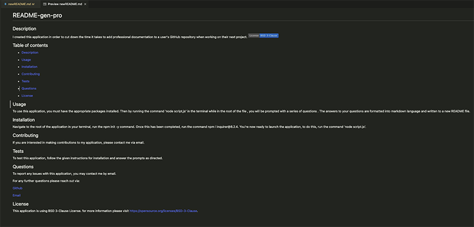
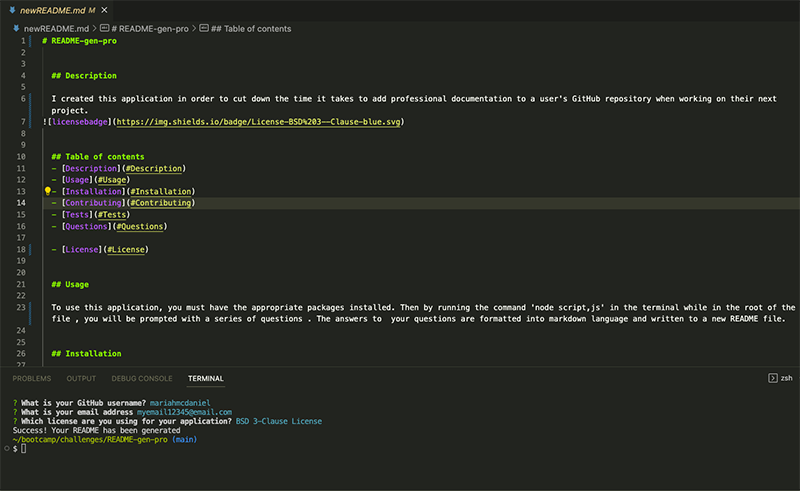

# README-gen-pro

 ## Description

  This CLI based application generates professional README files. It was created in order to reduce the time it takes to provide documentation for your next project's repository.

  click here to access my application

  ## Table of contents
  - [Description](#Description)
  - [Usage](#Usage)
  - [Installation](#Installation)
  - [Visuals](#visuals)
  - [Questions](#Questions)

  ## Usage

  To use this application, you must have inquirer version 8.2.4 initialized and installed. 

  ## Installation

  Navigate to the root of the application in your terminal, run the npm init -y command. Once this has been completed, run the command npm i inquirer@8.2.4. You're now ready to launch the application, to do this, run the command 'node script.js'. 

  ## Visuals
  
  [click here to view the demo](https://drive.google.com/file/d/1B5wdOpcjB3rpDGHG3fOET0KcC-uCocAv/view)

    Images:

  

  

  ## Questions

  For any further questions please reach out via:

  [Github](https://github.com/mariahmcdaniel)

  [Email](mailto:mariahmcdaniel@icloud.com)

  
  